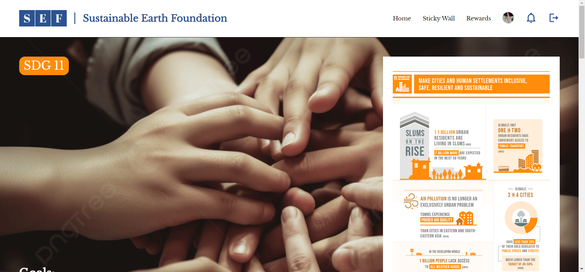

# Sustainable Earth Foundation



Awareness website for WEB2202 Web Programming.

Built together with Xiao Hui.

[Source Repository](https://github.com/ChiefWoods/sustainable-earth-foundation)

## Features

- Signup for an account
- Create sticky wall posts
- Cast votes with other users
- Exchange points for rewards
- Manage existing database as an admin

## Built With

### Languages

- [](https://html5.org/)
- [](https://www.w3.org/Style/CSS/Overview.en.html)
- [](https://js.org/index.html)
- [](https://www.php.net/)
- [](https://mariadb.org/)

### Tools

- [](https://code.visualstudio.com/)
- [](https://www.apachefriends.org/)
- [](https://www.phpmyadmin.net/)

## Getting Started

### Prerequisites

The Apache and MySQL modules from [XAMPP](https://www.apachefriends.org/) are required to load the database.

### Setup

1. Clone the repository into the htdocs folder of XAMPP
```
git clone https://github.com/ChiefWoods/sustainable-earth-foundation.git
```
2. Open XAMPP Control Panel
3. Start Apache and MySQL modules

## Issues

View the [open issues](https://github.com/ChiefWoods/sustainable-earth-foundation/issues) for a full list of proposed features and known bugs.

## Acknowledgements

### Resources

- [Shields.io](https://shields.io/)
- [Google Fonts](https://fonts.google.com/)
- [Pictogrammers](https://pictogrammers.com/)
- [SDG](https://sdgs.un.org/)

## Contact

[chii.yuen@hotmail.com](mailto:chii.yuen@hotmail.com)
